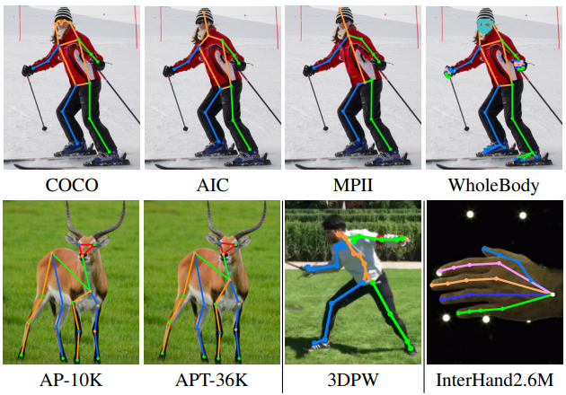

<h1 align="left">PoseBH: Prototypical Multi-Dataset Training Beyond Human Pose Estimation<a href="https://arxiv.org/abs/2505.17475">.svg" ></a> </h1>

<!--
[](https://paperswithcode.com/sota/pose-estimation-on-coco-test-dev?p=posebh-prototypical-multi-dataset-training)
[](https://paperswithcode.com/sota/pose-estimation-on-ochuman?p=posebh-prototypical-multi-dataset-training)
-->

> PoseBH: Prototypical Multi-Dataset Training Beyond Human Pose Estimation <br>
> Uyoung Jeong, Jonathan Freer, Seungryul Baek, Hyung Jin Chang, Kwang In Kim <br>
> CVPR 2025



PoseBH is a new multi-dataset training framework tackles keypoint heterogeneity and limited
supervision through two key techniques. (1) Keypoint prototypes for learning arbitrary keypoints from
multiple datasets ensuring high transferability. (2) A cross-type self-supervision mechanism that aligns keypoint regression outputs with keypoint embeddings, enriching supervision for unlabeled keypoints.


## Model Zoo
Model weights trained with our method are provided in [Google Drive](https://drive.google.com/drive/folders/1NbLLdQqmBN6rgGmJiB_vslm_wFwFcWGM?usp=sharing).

Place the trained weights in `weights/posebh`. e.g., `weights/posebh/base.pth`.

In order to download baseline multi-head weights, please download from [ViTPose](https://github.com/ViTAE-Transformer/ViTPose) repository.

## Evaluation Results
### COCO val set
Using detection results from a detector that obtains 56 mAP on person. Configs in the table are only for evaluation.

| Model | Resolution | AP | AR | config |
| :----: | :----: | :----: | :----: | :----: |
| ViTPose++-B | 256x192 | 77.0 | 82.6 | [config](configs/body/2d_kpt_sview_rgb_img/topdown_heatmap/coco/ViTPose_base_coco_256x192.py) |
| ViTPose++-H | 256x192 | 79.4 | 84.8 | [config](configs/body/2d_kpt_sview_rgb_img/topdown_heatmap/coco/ViTPose_huge_coco_256x192.py) |
| PoseBH-B | 256x192 | 77.3 | 82.4 | [config](configs/body/2d_kpt_sview_rgb_img/topdown_heatmap/coco/ViTPose_base_coco_256x192.py) |
| PoseBH-H | 256x192 | 79.5 | 84.5 | [config](configs/body/2d_kpt_sview_rgb_img/topdown_heatmap/coco/ViTPose_huge_coco_256x192.py) |

### COCO test-dev set
Using detection results from a detector that obtains 60.9 mAP on person. Configs in the table are only for evaluation.

| Model | Resolution | AP | AR | config |
| :----: | :----: | :----: | :----: | :----: |
| ViTPose++-B | 256x192 | 76.4 | 81.5 | [config](configs/body/2d_kpt_sview_rgb_img/topdown_heatmap/coco/ViTPose_base_coco_256x192_testdev.py) |
| ViTPose++-H | 256x192 | 78.5 | 83.4 | [config](configs/body/2d_kpt_sview_rgb_img/topdown_heatmap/coco/ViTPose_huge_coco_256x192_testdev.py) |
| PoseBH-B | 256x192 | 76.6 | 81.7 | [config](configs/body/2d_kpt_sview_rgb_img/topdown_heatmap/coco/ViTPose_base_coco_256x192_testdev.py) |
| PoseBH-H | 256x192 | 78.6 | 83.5 | [config](configs/body/2d_kpt_sview_rgb_img/topdown_heatmap/coco/ViTPose_huge_coco_256x192_testdev.py) |

### OCHuman test set
Using ground-truth bounding boxes. Configs in the table are only for evaluation.
| Model | Resolution | AP | AR | config |
| :----: | :----: | :----: | :----: | :----: |
| ViTPose++-B | 256x192 | 82.6 | 84.8 | [config](configs/body/2d_kpt_sview_rgb_img/topdown_heatmap/ochuman/ViTPose_base_ochuman_256x192.py) |
| ViTPose++-H | 256x192 | 85.7 | 87.4 | [config](configs/body/2d_kpt_sview_rgb_img/topdown_heatmap/ochuman/ViTPose_huge_ochuman_256x192.py) |
| PoseBH-B | 256x192 | 83.1 | 85.1 | [config](configs/body/2d_kpt_sview_rgb_img/topdown_heatmap/ochuman/ViTPose_base_ochuman_256x192.py) |
| PoseBH-H | 256x192 | 87.0 | 88.4 | [config](configs/body/2d_kpt_sview_rgb_img/topdown_heatmap/ochuman/ViTPose_huge_ochuman_256x192.py) |

### MPII val set
Using groundtruth bounding boxes. Configs in the table are only for evaluation.

| Model | Resolution | PCKh | PCKh@0.1 | config |
| :----: | :----: | :----: | :----: | :----: |
| ViTPose++-B | 256x192 | 92.8 | 39.1 | [config](configs/body/2d_kpt_sview_rgb_img/topdown_heatmap/mpii/ViTPose_base_mpii_256x192.py) |
| ViTPose++-H | 256x192 | 94.2 | 41.6 | [config](configs/body/2d_kpt_sview_rgb_img/topdown_heatmap/mpii/ViTPose_huge_mpii_256x192.py) |
| PoseBH-B | 256x192 | 93.2 | 39.3 | [config](configs/body/2d_kpt_sview_rgb_img/topdown_heatmap/mpii/ViTPose_base_mpii_256x192.py) |
| PoseBH-H | 256x192 | 94.2 | 42.3 | [config](configs/body/2d_kpt_sview_rgb_img/topdown_heatmap/mpii/ViTPose_huge_mpii_256x192.py) |


### AI Challenger val set
Using groundtruth bounding boxes. Configs in the table are only for evaluation.

| Model | Resolution | AP | AR | config |
| :----: | :----: | :----: | :----: | :----: |
| ViTPose++-B | 256x192 | 31.8 | 36.3 | [config](configs/body/2d_kpt_sview_rgb_img/topdown_heatmap/aic/ViTPose_base_aic_256x192.py) |
| ViTPose++-H | 256x192 | 34.8 | 39.1 | [config](configs/body/2d_kpt_sview_rgb_img/topdown_heatmap/aic/ViTPose_huge_aic_256x192.py) |
| PoseBH-B | 256x192 | 32.1 | 36.7 | [config](configs/body/2d_kpt_sview_rgb_img/topdown_heatmap/aic/ViTPose_base_aic_256x192.py) |
| PoseBH-H | 256x192 | 35.1 | 39.5 | [config](configs/body/2d_kpt_sview_rgb_img/topdown_heatmap/aic/ViTPose_huge_aic_256x192.py) |


### AP-10K test set
Using groundtruth bounding boxes. Configs in the table are only for evaluation.

| Model | Resolution | AP | AR | config |
| :----: | :----: | :----: | :----: | :----: |
| ViTPose++-B | 256x192 | 74.5 | - | [config](configs/animal/2d_kpt_sview_rgb_img/topdown_heatmap/ap10k/ViTPose_base_ap10k_256x192.py) |
| ViTPose++-H | 256x192 | 82.4 | - | [config](configs/animal/2d_kpt_sview_rgb_img/topdown_heatmap/ap10k/ViTPose_huge_ap10k_256x192.py) |
| PoseBH-B | 256x192 | 75.0 | 78.3 | [config](configs/animal/2d_kpt_sview_rgb_img/topdown_heatmap/ap10k/ViTPose_base_ap10k_256x192.py) |
| PoseBH-H | 256x192 | 82.6 | 85.4 | [config](configs/animal/2d_kpt_sview_rgb_img/topdown_heatmap/ap10k/ViTPose_huge_ap10k_256x192.py) |

### APT-36K test set
Using groundtruth bounding boxes. Configs in the table are only for evaluation.
Note that we could not acquire preprocessed APT-36K annotations that are used in VITPose training, so we preprocessed APT-36K annotations ourselves. For fair comparison, please check the Table 2 of our main paper.
APT-36K preprocessing script is at `tools/dataset/prepro_apt36k.py`.

| Model | Resolution | AP | AR | config |
| :----: | :----: | :----: | :----: | :----: |
| ViTPose++-B | 256x192 | 75.9 | - | [config](configs/animal/2d_kpt_sview_rgb_img/topdown_heatmap/apt36k/ViTPose_base_apt36k_256x192.py) |
| ViTPose++-H | 256x192 | 82.3 | - | [config](configs/animal/2d_kpt_sview_rgb_img/topdown_heatmap/apt36k/ViTPose_huge_apt36k_256x192.py) |
| PoseBH-B | 256x192 | 87.2 | 89.6 | [config](configs/animal/2d_kpt_sview_rgb_img/topdown_heatmap/apt36k/ViTPose_base_apt36k_256x192.py) |
| PoseBH-H | 256x192 | 90.6 | 92.6 | [config](configs/animal/2d_kpt_sview_rgb_img/topdown_heatmap/apt36k/ViTPose_huge_apt36k_256x192.py) |

### WholeBody dataset
Configs in the table are only for evaluation.

| Model | Resolution | AP | AR | config |
| :----: | :----: | :----: | :----: | :----: |
| ViTPose++-B | 256x192 | 57.4 | - | [config](configs/wholebody/2d_kpt_sview_rgb_img/topdown_heatmap/coco-wholebody/ViTPose_base_wholebody_256x192.py) |
| ViTPose++-H | 256x192 | 60.6 | - | [config](configs/wholebody/2d_kpt_sview_rgb_img/topdown_heatmap/coco-wholebody/ViTPose_huge_wholebody_256x192.py) |
| PoseBH-B | 256x192 | 57.9 | 69.5 | [config](configs/wholebody/2d_kpt_sview_rgb_img/topdown_heatmap/coco-wholebody/ViTPose_base_wholebody_256x192.py) |
| PoseBH-H | 256x192 | 62.0 | 72.9 | [config](configs/wholebody/2d_kpt_sview_rgb_img/topdown_heatmap/coco-wholebody/ViTPose_huge_wholebody_256x192.py) |

### Transfer on InterHand2.6M

| Model | Resolution | PCK | AUC | EPE | config |
| :----: | :----: | :----: | :----: | :----: | :---: |
| ViTPose++-B | 256x192 | 98.3 | 86.2 | 4.02 | [config](configs/hand/2d_kpt_sview_rgb_img/topdown_heatmap/interhand2d/ViTPose_base_interhand2d_all_256x192.py) |
| PoseBH-B (paper) | 256x192 | 98.6 | 87.1 | 3.70 | [config](configs/hand/2d_kpt_sview_rgb_img/topdown_heatmap/interhand2d/ViTPose_huge_interhand2d_all_256x192.py) |
| PoseBH-B | 256x192 | 98.7 | 86.6 | 3.61 | [config](configs/hand/2d_kpt_sview_rgb_img/topdown_heatmap/interhand2d/ViTPose_huge_interhand2d_all_256x192.py) |

### Transfer on 3DPW

| Model | Resolution | AP | AR | config |
| :----: | :----: | :----: | :----: | :----: |
| ViTPose++-B | 256x192 | 81.7 | 85.2 | [config](configs/hand/2d_kpt_sview_rgb_img/topdown_heatmap/interhand2d/ViTPose_base_interhand2d_all_256x192.py) |
| PoseBH-B (paper) | 256x192 | 83.6 | 87.1 | [config](configs/hand/2d_kpt_sview_rgb_img/topdown_heatmap/interhand2d/ViTPose_huge_interhand2d_all_256x192.py) |
| PoseBH-B | 256x192 | 83.8 | 87.1 | [config](configs/hand/2d_kpt_sview_rgb_img/topdown_heatmap/interhand2d/ViTPose_huge_interhand2d_all_256x192.py) |

## Usage
### Setup
We use Ubuntu 20, Python 3.8, PyTorch 1.11.0, cuda 11.3, and mmcv 1.4.8 for the experiments.

conda environment setup
```
conda create -n posebh python=3.8 -y
conda activate posebh
```

``` pytorch 1.11.0 compatible version
pip install torch==1.11.0+cu113 torchvision==0.12.0+cu113 --extra-index-url https://download.pytorch.org/whl/cu113
```

mmcv install:
```
pip install "git+https://github.com/open-mmlab/mmcv.git@v1.4.8"
```

```
cd /path/to/PoseBH
pip install -v -e .
```

install other packages
```bash
pip install -r requirements.txt
```

### Directory Tree
```
data
├─ aic
├─ ap10k
├─ ap36k
├─ coco
└─ mpii

weights
├─ vitpose+_base.pth
└─ vitpose+_huge.pth

split_weights
└─ base_coco.pth
```
Download `vitpose+_base.pth` and `vitpose+_huge.pth` file from [ViTPose](https://github.com/ViTAE-Transformer/ViTPose).
To get the `base_coco.pth` file, run `tools/model_split.py` on `vitpose+_base.pth` file.

### Training
After downloading the pretrained models, please conduct the experiments by running

```bash
# for single machine
bash tools/dist_train.sh <Config PATH> <NUM GPUs> --cfg-options model.pretrained=<Pretrained PATH> --seed 0

# for multiple machines
python -m torch.distributed.launch --nnodes <Num Machines> --node_rank <Rank of Machine> --nproc_per_node <GPUs Per Machine> --master_addr <Master Addr> --master_port <Master Port> tools/train.py <Config PATH> --cfg-options model.pretrained=<Pretrained PATH> --launcher pytorch --seed 0
```

We provide multi-dataset-training config files as below:
- `configs/body/2d_kpt_sview_rgb_img/topdown_heatmap/mdt/vitb_posebh.py`
- `configs/body/2d_kpt_sview_rgb_img/topdown_heatmap/mdt/vith_posebh.py`

We also provide a bash script for training ViTPose++-Base with our method in `scripts/train_vitb_posebh.sh`.

### Evaluation
To test the pretrained models performance, please run 

```bash
bash tools/dist_test.sh <Config PATH> <Checkpoint PATH> <NUM GPUs>
```

For our multi-dataset-trained models, please first re-organize the weights using

```bash
python tools/model_split.py --source <Pretrained PATH>
```

An exemplar evaluation bash script is provided in `scripts/eval_vitb_mdt.sh`.


### Transfer
We provide transfer config files as below:
- `configs/hand/2d_kpt_sview_rgb_img/topdown_heatmap/interhand2d/vitb_posebh_interhand2d_256x192.py`
- `configs/body/2d_kpt_sview_rgb_img/topdown_heatmap/pw3d/vitb_posebh_pw3d_2d_256x192.py`

In order to perform transfer learning, you may need to remove prototypes in the pretrained checkpoint file. Use `tools/remove_proto.py` script, similar to below:

```bash
python tools/remove_proto.py --source work_dirs/vitb_posebh/epoch_100.pth
```

After the checkpoint is prepared, run the experiment like below:

```bash
python -m torch.distributed.launch --nnodes 1 --node_rank 0 --nproc_per_node 4 --master_addr 127.0.0.1 --master_port 23459 tools/train.py configs/body/2d_kpt_sview_rgb_img/topdown_heatmap/pw3d/vitb_posebh_interhand2d_256x192.py --launcher pytorch --seed 0 --cfg-options model.multihead_pretrained=work_dirs/vitb_posebh/epoch_100_no_proto.pth
```

## Citation
```

```

## Acknowledgements
- [mmpose](https://github.com/open-mmlab/mmdetection)
- [ViTPose](https://github.com/ViTAE-Transformer/ViTPose)
- [ProtoSeg](https://github.com/tfzhou/ProtoSeg)
